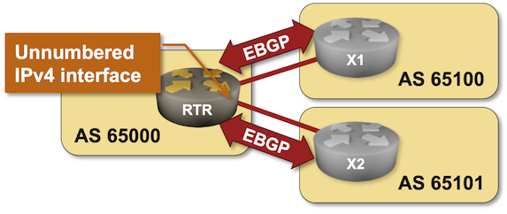
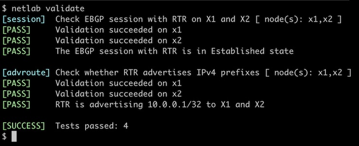

# EBGP Sessions over IPv6 LLA Interfaces

BGP needs TCP sessions to run, and every TCP session needs a remote IP address to be established. That's why we always had to configure the IPv4 or IPv6 addresses of the BGP neighbors.

A few years ago, Cumulus Networks engineers got an [interesting idea](https://blog.ipspace.net/2015/02/bgp-configuration-made-simple-with.html): IPv6 ICMP messages could be used on an IPv6 interface to find the IPv6 link-local address (LLA) of the peer router[^P2P], and the remote IPv6 LLA could be used to establish an EBGP session with that router. Throw [RFC 8950](https://datatracker.ietf.org/doc/html/rfc8950) into the mix, and you have a solution in which you could specify *interfaces* on which you want to run EBGP, not the neighbors' IP addresses ([more details](https://blog.ipspace.net/2022/11/bgp-unnumbered-duct-tape.html)). That's what you'll practice in this lab exercise.

[^P2P]: Automatic discovery of remote endpoints of EBGP sessions usually works only on point-to-point links.



!!! tip
    This lab focuses on a somewhat advanced trick usually encountered in data centers that use EBGP instead of an IGP. EBGP over IPv6 LLA is rarely used in Service Provider environments. You might want to skip it if you're just starting your BGP journey.

## Existing BGP Configuration

The routers in your lab use the following BGP AS numbers. Each router advertises an IPv4 prefix.

| Node/ASN | Router ID | Advertised prefixes |
|----------|----------:|--------------------:|
| **AS65000** ||
| rtr | 10.0.0.1 | 10.0.0.1/32 |
| **AS65100** ||
| x1 | 10.0.0.10 | 192.168.100.0/24 |
| **AS65101** ||
| x2 | 10.0.0.11 | 192.168.101.0/24 |

X1 and X2 expect your router to initiate an EBGP over IPv6 link-local addresses and negotiate IPv4 address family over that session.

!!! tip
    Your router has an interface with an IPv4 address and an unnumbered IPv4 interface. X1 and X2 have unnumbered IPv4 interfaces ([more details](#addr)). EBGP over IPv6 LLA is thus the only way to establish BGP sessions between them.
    
## Start the Lab

Assuming you already [set up your lab infrastructure](../1-setup.md):

* Change directory to `basic/d-interface`
* Execute **netlab up** ([device requirements](#req), [other options](../external/index.md))
* Log into your device (RTR) with **netlab connect rtr** and verify its configuration.

## Configuration Tasks

The configuration process is reasonably simple on Cumulus Linux and FRR:

* Make sure the EBGP interfaces have IPv6 link-local addresses.
* Configure interface EBGP neighbors with **neighbor _name_ interface remote-as _asn_**
* Add neighbor descriptions and BGP neighbor status logging
* Activate the EBGP neighbor within the IPv4 address family.

Other platforms might have more convoluted requirements. For example, you must enable IPv6 routing and create a BGP peer group on Arista EOS.

!!! Warning
    If your device happens to be [fully compliant with RFC 8212](https://blog.ipspace.net/2023/06/default-ebgp-policy-rfc-8212.html) (example: Cisco IOS XR), you'll have to configure a *permit everything* incoming- and outgoing filters on all EBGP neighbors.

## Verification

You can use the **netlab validate** command if you use *netlab* release 1.7.0 or later and Cumulus Linux or FRR on the external routers.



You can also check the state of BGP sessions on your router. A command similar to **show ip bgp summary** should display two BGP sessions with IPv6 link-local addresses. This is a printout taken from Arista EOS:

```
rtr>show ip bgp summary
BGP summary information for VRF default
Router identifier 10.0.0.1, local AS number 65000
Neighbor Status Codes: m - Under maintenance
  Neighbor                      V AS           MsgRcvd   MsgSent  InQ OutQ  Up/Down State   PfxRcd PfxAcc
  fe80::a8c1:abff:fe16:692b%Et2 4 65101              8        11    0    0 00:00:08 Estab   1      1
  fe80::a8c1:abff:fe35:de9%Et1  4 65100              8        11    0    0 00:00:08 Estab   1      1
```

The **show ip bgp** (or similar) command should display IPv4 prefixes with IPv6 next hops (or bogus IPv4 next hops). This is how the BGP table looks on Arista EOS:

```
rtr>show ip bgp
BGP routing table information for VRF default
Router identifier 10.0.0.1, local AS number 65000
Route status codes: s - suppressed contributor, * - valid, > - active, E - ECMP head, e - ECMP
                    S - Stale, c - Contributing to ECMP, b - backup, L - labeled-unicast
                    % - Pending best path selection
Origin codes: i - IGP, e - EGP, ? - incomplete
RPKI Origin Validation codes: V - valid, I - invalid, U - unknown
AS Path Attributes: Or-ID - Originator ID, C-LST - Cluster List, LL Nexthop - Link Local Nexthop

          Network                Next Hop              Metric  AIGP       LocPref Weight  Path
 * >      10.0.0.1/32            -                     -       -          -       0       i
 * >      192.168.100.0/24       fe80::a8c1:abff:fe35:de9%Et1 0       -          100     0       65100 i
 * >      192.168.101.0/24       fe80::a8c1:abff:fe16:692b%Et2 0       -          100     0       65101 i
```

IPv6 LLA next hops could also appear in the IPv4 routing table:

```
rtr>show ip route | begin Gateway
Gateway of last resort is not set

 C        10.0.0.1/32 [0/0]
           via Loopback0, directly connected
 C        10.1.0.0/30 [0/0]
           via Ethernet1, directly connected
 B E      192.168.100.0/24 [200/0]
           via fe80::a8c1:abff:fe35:de9, Ethernet1
 B E      192.168.101.0/24 [200/0]
           via fe80::a8c1:abff:fe16:692b, Ethernet2
```

## Device Requirements {#req}

* While you can use any device [supported by the _netlab_ BGP configuration module](https://netlab.tools/platforms/#platform-routing-support) as the customer router, it does not make sense to try to do the lab with devices that do not support EBGP sessions over IPv6 link-local addresses
* External routers have to support EBGP over IPv6 LLA and RFC 8950. *netlab* releases up to (and including) 1.8.0 can use Cumulus Linux, Dell OS10, FRR, Nokia SR Linux, or VyOS as external routers. Use the **netlab show modules -m bgp** command to display the BGP features supported by various network devices in your *netlab* release; the device you want to use as an external router has to support **ipv6_lla** and **rfc8950** features.
* You can do automated lab validation when running Cumulus Linux or FRR on the external router. Automated lab validation requires _netlab_ release 1.7.0 or higher.
* Git repository contains external router initial device configurations for Cumulus Linux.

## Reference Information

This lab uses a subset of the [4-router lab topology](../external/4-router.md). The following information might help you if you plan to build custom lab infrastructure:

### Lab Wiring

| Origin Device | Origin Port | Destination Device | Destination Port |
|---------------|-------------|--------------------|------------------|
| rtr | Ethernet1 | x1 | swp1 |
| rtr | Ethernet2 | x2 | swp1 |

### Lab Addressing {#addr}

| Node/Interface | IPv4 Address | IPv6 Address | Description |
|----------------|-------------:|-------------:|-------------|
| **rtr** |  10.0.0.1/32 |  | Loopback |
| Ethernet1 | 10.1.0.1/30 |  | rtr -> x1 |
| Ethernet2 | True |  | rtr -> x2 |
| **x1** |  192.168.100.1/24 |  | Loopback |
| swp1 | True |  | x1 -> rtr |
| **x2** |  192.168.101.1/24 |  | Loopback |
| swp1 | True | True | x2 -> rtr |
