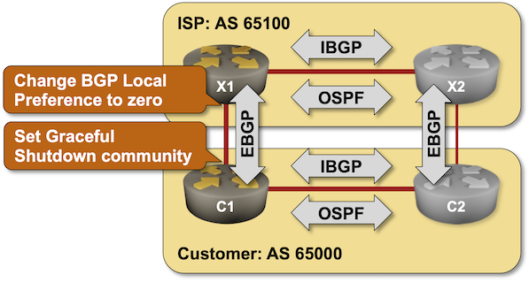

# BGP Graceful Shutdown

Imagine you have to perform maintenance of the primary uplink of your mission-critical site. You could shut down the link (or power off the router) and wait for a few minutes for the global Internet to adapt to the change[^ES], or you could do the right thing and try to shift the traffic to the backup link before shutting down the primary one.

Shifting the traffic away from a link scheduled for maintenance has two components:

* Telling everyone in your autonomous system not to use the affected link, usually by setting the [BGP local preference](../policy/5-local-preference.md) of all prefixes received over that link to zero.
* Telling the upstream provider not to use the link. [RFC 8326](https://www.rfc-editor.org/rfc/rfc8326.html) defines the recommended tool for the job: the GRACEFUL_SHUTDOWN community.

In this lab exercise, you'll implement the configuration changes needed to support the BGP Graceful Shutdown functionality on a customer and a provider router and test the graceful shutdown procedure.

[^ES]: While enjoying listening to the sounds of a million alerts and the screaming VP of Marketing.

!!! Expert
    We expect you have completed most of the foundational labs and know what you're doing. All you'll get from us are high-level guidelines.

!!! Tip
    This lab is still under development. Follow [blog.ipspace.net](https://blog.ipspace.net/) or [Ivan Pepelnjak on LinkedIn](https://www.linkedin.com/in/ivanpepelnjak/) to find out when it will be ready.