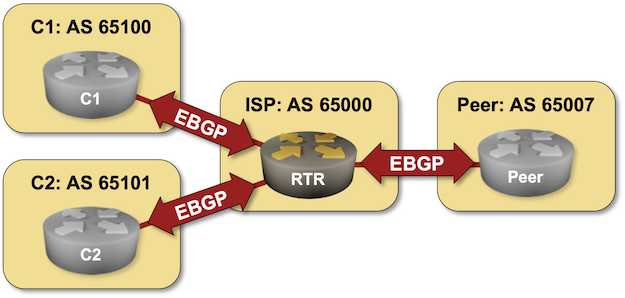

# Stop the Propagation of Configuration Errors

*Nobody is perfect*, including the networking engineers configuring BGP in your customers' networks. Still, it's your job as a responsible Internet Service Provider to filter the results of those mistakes before they reach the wider Internet.[^VZ]

[^VZ]: A concept [totally foreign to some very large ISPs](https://blog.ipspace.net/2019/07/rant-some-internet-service-providers.html).

In the ideal world, you'd use RPKI and accept only valid prefixes belonging to your customers. Failing that, you could get valid customer prefixes from internet routing registries, but that's extra unpaid work. There's no excuse, however, for not deploying basic sanity checks, and that's what you'll configure in this exercise.


    
## Start the Lab

Assuming you already [set up your lab infrastructure](../1-setup.md):

* Change directory to `challenge/04-block-fat-fingers`
* Execute **netlab up** ([device requirements](#req))
* Log into your router (RTR) with the **netlab connect rtr** command and verify that the IP addresses and the EBGP sessions are properly configured.

## The Problem

Your customers (C1 and C2) are advertising a plethora of prefixes that should not be advertised on the global Internet:

* IPv4 prefixes belonging to the private (RFC 1918) address space;
* Too-short prefixes (prefixes more specific than /24)
* Transit prefixes (prefixes originating in third-party autonomous systems)
* Prefixes with too-long AS paths
* A default route

Log into your router and explore its BGP table. You'll find at least one prefix matching one of the above criteria. This is the BGP table on RTR as displayed by Cumulus Linux:

```
rtr# show ip bgp
BGP table version is 14, local router ID is 10.0.0.1, vrf id 0
Default local pref 100, local AS 65000
Status codes:  s suppressed, d damped, h history, * valid, > best, = multipath,
               i internal, r RIB-failure, S Stale, R Removed
Nexthop codes: @NNN nexthop's vrf id, < announce-nh-self
Origin codes:  i - IGP, e - EGP, ? - incomplete

   Network          Next Hop            Metric LocPrf Weight Path
*> 0.0.0.0/0        10.1.0.1                 0             0 65100 i
*> 10.0.0.2/32      10.1.0.1                 0             0 65100 i
*> 10.0.0.3/32      10.1.0.5                 0             0 65101 i
*> 100.64.1.1/32    10.1.0.5                 0             0 65101 i
*> 100.68.0.0/15    10.1.0.5                 0             0 65101 i
*> 100.73.16.0/22   10.1.0.1                 0             0 65100 i
*> 100.75.42.0/23   10.1.0.1                 0             0 65100 65303 i
*> 100.75.142.0/24  10.1.0.5                 0             0 65101 65101 65101 65101 65101 65101 65101 65101 65101 65101 65101 i
*> 100.78.43.0/24   10.1.0.5                 0             0 65101 i
*> 169.254.7.0/24   10.1.0.5                 0             0 65101 i
*> 172.16.1.0/24    10.1.0.1                 0             0 65100 i
*> 172.30.30.0/24   10.1.0.5                 0             0 65101 i
*> 192.168.1.0/24   10.1.0.1                 0             0 65100 i
*> 198.51.100.0/24  10.1.0.9                 0             0 65107 i
```

!!! tip
    Using public IPv4 prefixes in a lab is bad form, so we'll pretend the *Shared Address Space* prefix (100.64.0.0/10) belongs to public address space.

## Configuration Tasks

Using a *policy template*, create a generic customer-facing routing policy that will drop:

* prefixes from the RFC 1918 address space,
* prefixes that are more specific than /24 or less specific than /16 (that would include the default route),
* prefixes that have more than one autonomous system in the AS path,
* prefixes that have an AS path with more than five elements.

You should also only accept up to five prefixes from a customer.

Once you created the policy template, apply it to all EBGP sessions with your customers.

Use these lab exercises to master individual filtering- or configuration mechanisms you'll need to complete the configuration tasks:

* [Limit the Number of Accepted BGP Prefixes](../basic/b-max-prefix.md)
* [Filter Transit Routes](../policy/2-stop-transit.md)
* [Filter Advertised Prefixes](../policy/3-prefix.md)
* [Minimize the Size of Your BGP Table](../policy/4-reduce.md)
* [BGP Session Templates](../session/6-templates.md)
* [BGP Policy Templates](../session/7-policy.md)

## Verification

Once you have deployed all the required input filters, you should see the following prefixes in the BGP table on your router:

```
rtr# show ip bgp
BGP table version is 14, local router ID is 10.0.0.1, vrf id 0
Default local pref 100, local AS 65000
Status codes:  s suppressed, d damped, h history, * valid, > best, = multipath,
               i internal, r RIB-failure, S Stale, R Removed
Nexthop codes: @NNN nexthop's vrf id, < announce-nh-self
Origin codes:  i - IGP, e - EGP, ? - incomplete

   Network          Next Hop            Metric LocPrf Weight Path
*> 100.73.16.0/22   10.1.0.1                 0             0 65100 i
*> 100.78.43.0/24   10.1.0.5                 0             0 65101 i
*> 198.51.100.0/24  10.1.0.9                 0             0 65107 i
```

## Device Requirements {#req}

* Use any device [supported by the _netlab_ BGP configuration module](https://netlab.tools/platforms/#platform-routing-support) for your router.
* Use Cumulus Linux or FRR for the customer- and peer routers.
* Git repository contains initial device configurations for Cumulus Linux.
