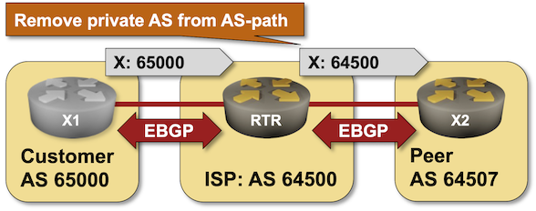

# Remove Private BGP AS Numbers from the AS Path

Some end customers use private BGP AS numbers when running BGP with their Internet Service Providers (ISPs). Those AS numbers should not appear in the BGP AS path when the ISP advertises those prefixes to its peers and upstream providers.



In this lab exercise, you'll use the *remove private AS* feature available in many BGP implementations to remove the customer's private BGP AS number from the BGP AS path sent in EBGP updates.

## Existing BGP Configuration

The routers in your lab use the following BGP AS numbers. Each router advertises an IPv4 prefix.

| Node/ASN | Router ID | Advertised prefixes |
|----------|----------:|--------------------:|
| **AS64500** ||
| rtr | 10.0.0.1 | 10.0.0.1/32 |
| **AS64507** ||
| x2 | 10.0.0.11 | 10.0.0.11/32 |
| **AS65000** ||
| x1 | 10.0.0.10 | 192.168.42.0/24 |

Your router has these EBGP neighbors.  _netlab_ configures them automatically; if you're using some other lab infrastructure, you'll have to manually configure EBGP neighbors and advertised prefixes.

Node | Neighbor | Neighbor AS | Neighbor IPv4 |
|------|----------|------------:|--------------:|
| **rtr** | x1 | 65000 | 10.1.0.2 |
|  | x2 | 64507 | 10.1.0.6 |

## Start the Lab

Assuming you already [set up your lab infrastructure](../1-setup.md):

* Change directory to `session/4-removeprivate`
* Execute **netlab up** ([device requirements](#req), [other options](../external/index.md))
* Log into your router (RTR) with the **netlab connect rtr** command and verify that the IP addresses and the EBGP sessions are properly configured.

## The Problem

Log into X2 and check its BGP table. You'll notice that the AS path for the prefix `192.168.42.0/24` contains a private AS number[^PAN] 65000 that should not be visible outside your autonomous system. For example, you would get the following printout when running Cumulus Linux on X2:[^NLS]

[^PAN]: AS numbers 64496-64511 are not private AS numbers. [RFC 5398](https://www.rfc-editor.org/rfc/rfc5398.html) reserved them for documentation. Private AS numbers start with AS 64512.

[^NLS]: You need _netlab_ release 1.7.0 or later to use the **netlab connect --show** command. Read [this document](../basic/0-frrouting.md) if you use an older _netlab_ release and use Cumulus Linux or FRR as the external routers.

```
$ netlab connect x2 -q --show ip bgp
BGP table version is 3, local router ID is 10.0.0.11, vrf id 0
Default local pref 100, local AS 64507
Status codes:  s suppressed, d damped, h history, * valid, > best, = multipath,
               i internal, r RIB-failure, S Stale, R Removed
Nexthop codes: @NNN nexthop's vrf id, < announce-nh-self
Origin codes:  i - IGP, e - EGP, ? - incomplete

   Network          Next Hop            Metric LocPrf Weight Path
*> 10.0.0.1/32      10.1.0.5                               0 64500 i
*> 10.0.0.11/32     0.0.0.0                  0         32768 i
*> 192.168.42.0/24  10.1.0.5                               0 64500 65000 i

Displayed  3 routes and 3 total paths
```

You must change your router's configuration to make AS 65000 disappear from the AS path.

## Configuration Tasks

Most BGP implementations have a nerd knob that removes private AS numbers from the AS path. It's usually configured with a command similar to **neighbor remove-private-as**.

* Configure removal of private AS numbers on the EBGP session between **rtr** and **x2**.

!!! Warning
    After changing the BGP configuration, you might have to do a soft reset of the EBGP session to force your router to resend the routing updates with modified AS paths.

## Verification

Check the BGP table on X2. None of the AS paths should contain private AS numbers. This is the printout you should get on Cumulus Linux:

```
$ netlab connect x2 -q --show ip bgp
BGP table version is 4, local router ID is 10.0.0.11, vrf id 0
Default local pref 100, local AS 64507
Status codes:  s suppressed, d damped, h history, * valid, > best, = multipath,
               i internal, r RIB-failure, S Stale, R Removed
Nexthop codes: @NNN nexthop's vrf id, < announce-nh-self
Origin codes:  i - IGP, e - EGP, ? - incomplete

   Network          Next Hop            Metric LocPrf Weight Path
*> 10.0.0.1/32      10.1.0.5                               0 64500 i
*> 10.0.0.11/32     0.0.0.0                  0         32768 i
*> 192.168.42.0/24  10.1.0.5                               0 64500 i

Displayed  3 routes and 3 total paths
```

## Reference Information

This lab uses a subset of the [4-router lab topology](../external/4-router.md). The following information might help you if you plan to build custom lab infrastructure:

### Device Requirements {#req}

* Use any device [supported by the _netlab_ BGP configuration module](https://netlab.tools/platforms/#platform-routing-support) for the customer- and provider routers.
* Git repository contains initial Cumulus Linux device configurations for X1 and X2.

### Lab Wiring

| Origin Device | Origin Port | Destination Device | Destination Port |
|---------------|-------------|--------------------|------------------|
| rtr | Ethernet1 | x1 | swp1 |
| rtr | Ethernet2 | x2 | swp1 |

### Lab Addressing

| Node/Interface | IPv4 Address | IPv6 Address | Description |
|----------------|-------------:|-------------:|-------------|
| **rtr** |  10.0.0.1/32 |  | Loopback |
| Ethernet1 | 10.1.0.1/30 |  | rtr -> x1 |
| Ethernet2 | 10.1.0.5/30 |  | rtr -> x2 |
| **x1** |  192.168.42.1/24 |  | Loopback |
| swp1 | 10.1.0.2/30 |  | x1 -> rtr |
| **x2** |  10.0.0.11/32 |  | Loopback |
| swp1 | 10.1.0.6/30 |  | x2 -> rtr |
