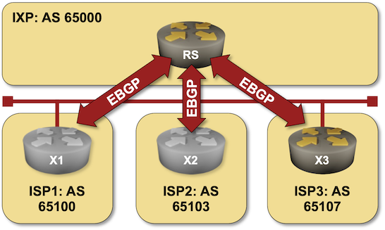

# BGP Route Server in an Internet Exchange Point

Internet Exchange Points (IXPs) provide a layer-2 network shared between participating Internet Service Providers (ISPs). While IP forwarding and BGP peering remain under the control of the ISPs, many IXPs offer a *route server* functionality -- participants can peer with a shared BGP daemon that distributes the participants' BGP prefixes *without modifying the AS path or BGP next hops*.

In this lab exercise, you'll implement a BGP route server on a small Internet Exchange Point.

!!! Tip
    This lab is still under development. Follow [blog.ipspace.net](https://blog.ipspace.net/) or [Ivan Pepelnjak on LinkedIn](https://www.linkedin.com/in/ivanpepelnjak/) to find out when it will be ready.